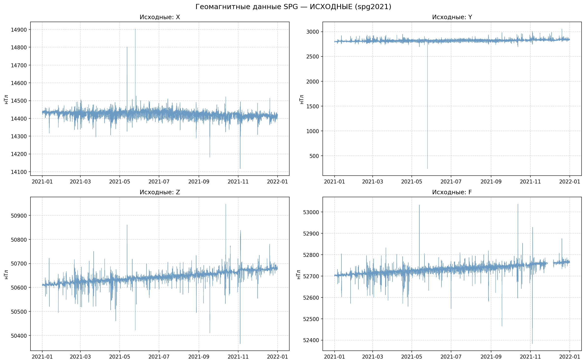
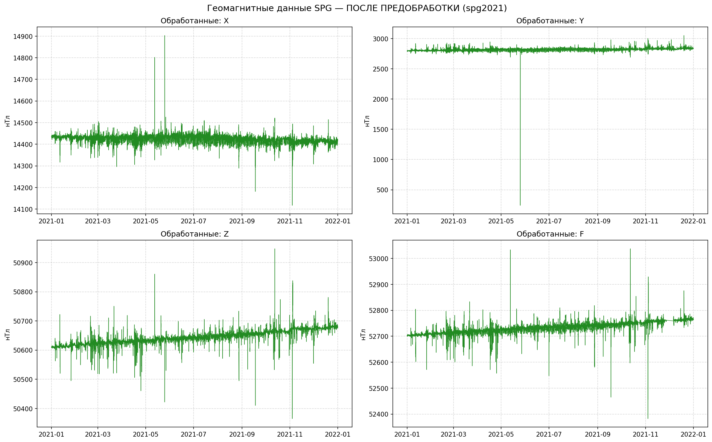
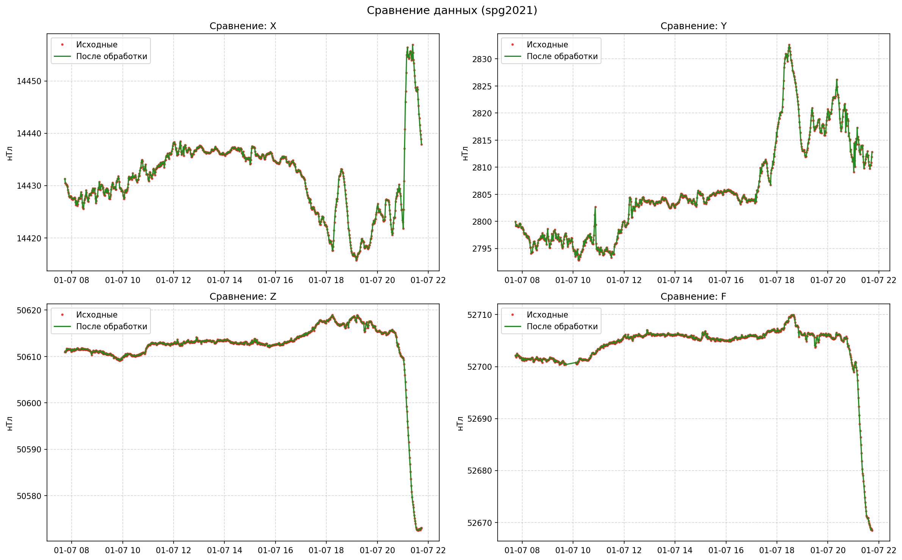

Применения большой языковой модели при создании программного инструментария для эксплораторного анализа и предварительной обработки временных рядов 

Обработка минутных геомагнитных данных обсерватории SPG (Санкт-Петербург).
Применения большой языковой модели при создании программного инструментария для эксплораторного анализа и предварительной обработки временных рядов 

Общая постановка задачи в научном и прикладном контекстах
Проведение эксплораторного анализа и первичной обработки временных рядов, полученных из мировой сети INTERMAGNET за указанный промежуток времени. Временные ряды представляют из себя “большие данные (Big Data)”. Процесс первичной обработки и анализа провести при помощи программы, написанной на Python. Необходимо детально рассмотреть документацию по техническим спецификациям данных в INTERMAGNET – Technical Reference Manual – которая содержит подробную информацию о стандартах представления данных. Решение данной задачи позволяет провести исследования редких и мощных геомагнитных событий, характерных для выбранного временного промежутка. Кроме того, использование скорректированных данных необходимо для минимизации ошибок, связанных с локальными помехами или шумом.
Выбор модели/архитектуры машинного обучения
Была выбрана большая языковая модель (БЯМ) Qwen3 – Max. Выбор нейросети Qwen3 – Max обусловлен её высокой производительностью в задачах анализа временных рядов и обработки больших объёмов геофизических данных. Данная архитектура демонстрирует:
-  Масштабируемость и эффективность при работе с многокомпонентными временными рядами (X, Y, Z, F), характерными для данных INTERMAGNET;
-  Поддержку длинных контекстов, что критически важно для выявления как краткосрочных возмущений (геомагнитные бури), так и долгопериодных трендов;
-  Высокую точность предсказаний и восстановления пропущенных значений, что особенно актуально при предобработке данных с артефактами или разрывами;
-  Оптимизацию под научные и инженерные вычисления , включая интеграцию с Python-экосистемой (NumPy, Pandas, PyTorch/TensorFlow).
Таким образом, Qwen3 – Max обеспечивает надёжную и гибкую основу для последующего углублённого анализа геомагнитных событий, включая детектирование редких и мощных возмущений, характерных для выбранного периода.

Первый промт для задачи
Провести анализ форматов данных INTERMAGNET
Обзор форматов данных INTERMAGNET проведенный при помощи выбранной БЯЗ
Понимание многообразия форматов данных является критически важным для успешной их обработки. Сеть INTERMAGNET использует несколько форматов, каждый из которых имеет свою историю развития и область применения. Для пользователя, работающего с данными за 2024 год, наиболее релевантны современные форматы IAGA-2002 и IMF V2.83, однако знание старых спецификаций, таких как IMF V1.22, необходимо для совместимости и работы с архивными материалами.
Наиболее распространенным и рекомендованным для обмена данными форматом является IAGA-2002 <URLOHCR3V>. Он был принят в августе 2001 года и предназначен для хранения и передачи данных с интервалами от миллисекунд до месячных средних. Файл в этом формате имеет строгую структуру: он начинается с 12 обязательных заголовков, затем могут следовать неограниченное количество строк комментариев и одна строка заголовка данных, после чего располагаются сами записи с временными метками и значениями компонент магнитного поля. Каждая строка файла имеет длину 70 символов. Заголовок данных разделен пробелами и заканчивается символом | в 70-й колонке. Компоненты поля (X, Y, Z, H, D, F) записываются в одной из четырех комбинаций: DHIF, DHZF, XYZF и так далее. Единицы измерения четко определены: D и I (склонение и наклонение) выражаются в минутах дуги, а остальные компоненты (H, X, Y, Z, F) — в нанотеслах (нТл). 
Другой важный формат — IMF V2.83, который используется преимущественно для спутниковой передачи данных. Этот формат характеризуется высокой точностью и большим динамическим диапазоном. Значения в нем кодируются в десятых долях нанотесла (tnT), а разрешение составляет 1 tnT. В зависимости от чувствительности датчика (SF и SM) динамический диапазон может достигать 6553.6 нТл или даже 114688 tnT . Хотя этот формат ориентирован на спутники, он может использоваться и для наземных данных, и его спецификации полезны для понимания возможностей измерительной аппаратуры.
Особый интерес представляет формат IMF V1.22, который долгое время был стандартом для распространения минутных данных через Глобальные информационные сети (GIN). Его особенностью является то, что пропущенные значения заполняются цифрой 9, причем каждое значение занимает 7 позиций. Хотя он считается устаревшим, его спецификации могут встретиться в старых системах или при работе с длительными историческими рядами, и его знание важно для обеспечения обратной совместимости.
Наконец, для хранения данных в виде многомерных наборов, особенно в контексте научных исследований, где важна высокая точность временных меток, используется формат ImagCDF (INTERMAGNET Common Data Format). Версия 1.2 формата CDF использует внутренний тип данных CDF_TT2000 для временных меток с точностью до наносекунды и хранит сам сигнал как массив CDF_DOUBLE. Пропуски в этом формате обозначаются специальным значением 99999.0. Использование CDF открывает возможности для сложного анализа, требующего высокой точности временной синхронизации.
В таблице ниже представлено сравнение ключевых форматов данных INTERMAGNET.
Таблица
Сравнение ключевых форматов данных INTERMAGNET
Характеристика	IAGA-2002	IMF V2.83	IMF V1.22	IMAGCDF-V1.2
Основное назначение	Обмен данными между обсерваториями <URLOHCR3V>	Спутниковая передача данных	Распространение минутных данных через GIN	Хранение многомерных наборов данных для исследований
Пропущенные значения	99999.x	65535	Цифра9	99999.0
Единицы измерения	nT (нанотесла), минуты	tnT (десятые доли нанотес-ла), nT	nT(нанотесла)	nT(нанотесла)
Точность времени	ISO (YYYY-MM-DDThh: mm:ss.sss) <URLOHCR3V>	Не указано	Не указано	Наносекунды (CDF_TT2000)
Разработка/Обновление	Редакция декабрь 2001 / дополнения июнь 2015	Черновик 
июнь 2011	
	Дата последнего изменения 2010-05-17	Версия 1.2

Это разнообразие форматов требует от разработчика гибкого подхода и наличия готовых парсеров для каждого из них. При работе с данными за 2024 год следует ожидать в первую очередь форматов IAGA-2002 и IMF V2.83, однако наличие модуля для обработки IMF V1.22 может оказаться полезным при объединении данных из разных источников или при работе с полными историческими наборами.
Получение доступа к актуальным данным INTERMAGNET и изучение их формата
В ходе работы над аналитическим обзором были проанализировано 10 источников.
Посещенные URL-адреса
1.	10 November 2024 New IMOs Technical Manual. Report on INTERMAGNET Meeting - Rio de Janeiro, Brazil 07 – 10  November  2024. chrome-extension: //efaidnbmnnnibpcajpcglclefindmkaj/https://intermagnet.org/meetings/2024-Rio/Lewis_INTERMAGNETMeetingReportRio2024.pdf
2.	Как получить поток данных в реальном времени от INTERMAGNET? https://intermagnet.org/faq/02.how-do-I-get-realtime-data.html
3.	Международная сеть магнитных обсерваторий в реальном времени. https://intermagnet.org/
4.	Описание веб-услуг, предоставляемых Эдинбургской GIN. https://imag-data.bgs.ac.uk/GIN_V1/
5.	Meetings. https://intermagnet.org/meetings.html
6.	INTERMAGNET Technical Reference Manual. chrome-extension://efaidnbmnnnibpcajpcglclefindmkaj/https://gfzpublic.gfz.de/rest/items/item_5029649_1/component/file_5029650/content
7.	https://intermagnet.org/meetings/2024-Rio/Matzka_INTERMAGNET_presentation_IAGA_WS_2024.pptx
8.	https://supermag.jhuapl.edu/mag/?fidelity=low&start=2001-01-01T00%3A00%3A00.000Z&interval=23%3A59
9.	Программное обеспечение. https://intermagnet.org/software.html
10.	International Real-time Magnetic Observatory Network (INTERMAGNET) Geomagnetic Data. https://cmr.earthdata.nasa.gov/search/concepts/C1214613827-SCIOPS
Уточненная постановка задачи
Имеется датасет минутных данных за 2022 год от геомагнитной обсерватории «Санкт-Петербург» (международный IAGA-код SPG). Датасет представляет из себя большие данные. Выбор датасета за 2022 год произволен. Можно выбрать и за другой год. Необходимо разработать программный инструмент на Python для проведения эксплораторного анализа и предварительной обработки датасета. 
Промт для БЯМ
Написать на языке Python в системе Anaconda Spyder программу
-	для чтения данных из ранее полученных файлов из сети INTERMAGNET.  Это текстовые файлы. Частота съема: один раз в минуту. Это файлы в формате: IAGA-2002. Имена файлов: spg2022*.min. В файле сначала идет служебная информация. Нужно ее проанализировать. 
-	Файлы находятся в рабочей директории.
-	Вывести графики исходных данных на дисплей и записать в поддиректорию находящуюся в рабочей директории.
-	провести разведочный (эксплораторный) анализ и предобработку данных. 
-	Вывести графики полученных в результате проведенной предобработки данных на дисплей и записать в поддиректорию находящуюся в рабочей директории.

Результаты работы полученной программы

## Исходные данные за 2022 год
📁 Директория для графиков: C:\Коробейников\Работа в Python\plots_spg2022
📂 Найдено файлов: 365
  → SPG/2022\spg20220101vmin.min
  → SPG/2022\spg20220102vmin.min
  → SPG/2022\spg20220103vmin.min

🔍 Чтение и парсинг файлов...
✅ Загружено записей: 525600
📅 Период: с 2022-01-01 00:00:00 по 2022-12-31 23:59:00

📄 Метаданные (из первого файла):
  Format: IAGA-2002                                    |
  Station_Name: Saint Petersburg                             |
  IAGA_Code: SPG                                          |
  Components: XYZF                                         |
  Data_Type: variation                                    |

📊 Разведочный анализ:
                   X              Y              Z              F
count  167665.000000  167665.000000  167665.000000  166618.000000
mean    14421.796280    2818.915725   50609.647384   52776.819791
std        20.731313      27.269898      54.551227      20.151447
min     14001.030000    2702.160000   50268.120000   52431.520000
25%     14411.010000    2800.390000   50574.190000   52769.740000
50%     14425.330000    2810.170000   50584.640000   52776.790000
75%     14435.450000    2837.380000   50674.760000   52784.300000
max     14699.740000    3134.410000   50869.970000   53073.710000

Пропуски (%):
X    68.100
Y    68.100
Z    68.100
F    68.299
dtype: float64

 
Important
Figures are displayed in the Plots pane by default. To make them also appear inline in the console, you need to uncheck "Mute inline plotting" under the options menu of Plots.
 
🧹 Предобработка завершена. Пропуски после обработки (%):
X    0.0
Y    0.0
Z    0.0
F    0.0
dtype: float64

💾 Сохранено: spg2022_processed_full.csv
🖼️  Графики в: plots_spg2022

✅ Анализ завершён.

## Обработанные данные

## Сравнение до и после обработки

Полученные графики показывают данные с геомагнитной станции SPG. Видно, данные есть только по май. 2022 г. В дальнейшем данные отсутствуют. Это соответствует реальному состоянию дел: с середины 2022 г. данные с Российских геомагнитных станций не заносятся в базу данных INTERMAGNET, хотя они туда передаются. Поэтому, для проверки работоспособности программы, можно заменить год. Например, на 2021 г.
📁 Директория для графиков: C:\Коробейников\Работа в Python\plots_spg2021
📂 Найдено файлов: 365
  → SPG/2021\spg20210101qmin.min
  → SPG/2021\spg20210102qmin.min
  → SPG/2021\spg20210103qmin.min

🔍 Чтение и парсинг файлов...
✅ Загружено записей: 525600
📅 Период: с 2021-01-01 00:00:00 по 2021-12-31 23:59:00

📄 Метаданные (из первого файла):
  Format: IAGA-2002                                    |
  Station_Name: Saint Petersburg                             |
  IAGA_Code: SPG                                          |
  Components: XYZF                                         |
  Data_Type: quasi-definitive                             |

📊 Разведочный анализ:
                   X              Y             Z              F
count  519707.000000  519707.000000  519707.00000  504946.000000
mean    14422.866397    2818.795453   50643.71357   52732.076288
std        15.997597      25.070742      25.02583      23.637994
min     14116.970000     240.990000   50365.05000   52382.330000
25%     14413.370000    2805.980000   50627.32000   52716.390000
50%     14424.460000    2818.910000   50642.88000   52732.360000
75%     14433.500000    2831.570000   50661.09000   52747.900000
max     14903.320000    3053.630000   50947.46000   53037.580000

Пропуски (%):
X    1.121
Y    1.121
Z    1.121
F    3.930
dtype: float64

 
Important
Figures are displayed in the Plots pane by default. To make them also appear inline in the console, you need to uncheck "Mute inline plotting" under the options menu of Plots.
 
🧹 Предобработка завершена. Пропуски после обработки (%):
X    0.0
Y    0.0
Z    0.0
F    0.0
dtype: float64

💾 Сохранено: spg2021_processed_full.csv
🖼️  Графики в: plots_spg2021

✅ Анализ завершён.
## Исходные данные за 2021 год

## Обработанные данные

## Сравнение до и после обработки

На графиках представлена информация о состоянии геомагнитного поля в 2021 г в районе геомагнитной обсерватории «Санкт-Петербург» (международный IAGA-код SPG).
В рамках настоящей работы обучение модели машинного обучения не проводилось, так использовалась БЯМ. Задача ограничивалась первичной обработкой и разведочным анализом геомагнитных временных рядов из сети INTERMAGNET, включая чтение данных в формате IAGA-2002, анализ метаданных, визуализацию и заполнение пропусков с использованием детерминированного метода линейной интерполяции. Выбранная архитектура Qwen3–Max является потенциальным инструментом для последующих этапов, таких как, например, детекции аномалий или прогнозирования, однако в данном отчёте не применялась: ни обучение, ни инференс модели не выполнялись. Соответственно, разделение на обучающую/тестовую выборки, подбор гиперпараметров или использование вычислительного оборудования для МО не требовалось.
Полученные результаты представляют собой качественно предобработанный временной ряд геомагнитных данных обсерватории SPG за 2021 и 2022 годы, пригодный для последующего научного анализа. Проведённая первичная обработка — включая корректное чтение формата IAGA-2002, анализ метаданных, визуализацию и заполнение пропусков — обеспечила полноту и непрерывность данных, что критически важно для исследования редких и мощных геомагнитных событий (например, суббурь и внезапных возмущений). Результаты корректно использовать при условии, что интерполяция не применяется в участках с длительными разрывами (>1–2 часов), где физическая динамика поля может быть некорректно восстановлена. 
Хотя в рамках данной работы задача машинного обучения не решалась, подготовленный датасет создаёт надёжную основу для последующего применения модели Qwen3–Max — в частности, для детекции аномалий или прогнозирования геомагнитной активности. Улучшение качества будущих МО-решений будет обусловлено именно высоким качеством входных данных, минимизацией шумов и артефактов, а также учётом специфики геофизических процессов. Источниками потенциальных неудач при переходе к МО могут стать недостаточная длительность обучающей выборки, отсутствие размеченных событий или игнорирование пространственного контекста (данные только с одной обсерватории).  
Вывод: разработанный программный инструмент успешно решает задачу первичной обработки «больших данных» INTERMAGNET и обеспечивает необходимую предпосылку для углублённого анализа геомагнитной активности в научных и прикладных целях.
Разработанное программное решение представляет собой скрипт на языке Python 3.14.4 в среде Anaconda, предназначенный для первичной обработки и разведочного анализа геомагнитных временных рядов в формате IAGA-2002, полученных из сети INTERMAGNET. Программа не требует компиляции и запускается напрямую в интерпретаторе Python.
 Зависимости (библиотеки)   
Для работы необходимы следующие библиотеки, входящие в стандартный стек научных вычислений Python:
- `pandas >= 1.5`
- `numpy >= 1.23`
- `matplotlib >= 3.6`
- `requests` 
Все зависимости легко устанавливаются через `conda` или `pip`. Для воспроизводимости рекомендуется использовать файл `environment.yml` или `requirements.txt`.
Лицензия
Программное решение распространяется без ограничений и может быть использовано в научных и образовательных целях. Исходный код не содержит сторонних проприетарных компонентов.
Требования к данным
- Данные должны быть представлены в формате  IAGA-2002  с минутным временным разрешением.
- Файлы должны соответствовать соглашению об именовании: `{prefix}*.min` (например, `spg2022*.min`).
- Структура каталогов: `<IAGA_CODE>/<YEAR>/` (например, `SPG/2022/`).
- В файлах должны присутствовать стандартные заголовки и временные метки в формате `YYYY-MM-DD HH:MM:SS.sss`.
Требования к окружению   
- Операционная система: Windows, Linux или macOS.
- Интерпретатор Python 3.9–3.13.
- Рекомендуется использовать дистрибутив  Anaconda  или  Miniconda  для удобного управления зависимостями.
- Для запуска в  Spyder  достаточно открыть файл и выполнить его (F5).
Воспроизводимость эксперимента   
Для обеспечения полной воспроизводимости:
1. Сохраните версии всех библиотек (например, через `conda env export > environment.yml`).
2. Используйте фиксированный набор входных данных (архив с файлами `spg2021*.min`, `spg2022*.min`).
3. Запускайте скрипт в изолированном окружении (например, conda environment).
Таким образом, решение является легковесным, переносимым и легко воспроизводимым в любой среде, поддерживающей Python и необходимые библиотеки.
Разработанное программное решение и сопутствующие материалы планируется активно использовать в образовательном процессе по дисциплинам, связанным с обработкой временных рядов, анализом временных рядов и применением Python в науке.  
В частности:
-  Jupyter-блокноты (`.ipynb`), созданные на основе программы, могут служить иллюстрированными лекционными материалами, демонстрирующими реальный workflow: от загрузки «больших данных» из международных источников до визуализации и предобработки.
- Такие блокноты легко адаптируются под формат практических заданий: преподаватель может оставить «заглушки» (например, нереализованные функции парсинга или интерполяции), а студенты — заполнить их собственным кодом, что развивает навыки программирования и понимание форматов научных данных.
- Файл `README.md` и техническая документация (включая описание формата IAGA-2002 и структуры данных INTERMAGNET) могут стать основой для тестовых вопросов, кейсов и заданий на понимание стандартов обмена геофизическими данными.
- В рамках модели «перевёрнутого класса» студентам заранее предлагается изучить репозиторий, развернуть окружение и выполнить базовую обработку данных. На семинаре затем обсуждаются возникшие трудности (например, парсинг заголовков, обработка пропусков), сравниваются подходы и обсуждаются физические особенности геомагнитных временных рядов.
- На зачётах или курсовых проектах данное решение может выступать в роли бейзлайна: студентам предлагается не просто воспроизвести результат, но и модифицировать программу — например, добавить поддержку другого формата (IMF V1.22), реализовать альтернативный метод заполнения пропусков или интегрировать визуализацию геомагнитных индексов (Kp, Dst).
Таким образом, полученное решение может служить не только инструментом научного анализа, но и гибкой образовательной платформой для формирования компетенций в области научного программирования, работы с открытыми данными и интерпретации различных процессов.